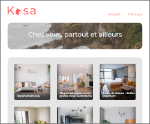

# OC_front

e-learning for front-end React knowledge.

* [P1:  Learning path planning.](./P1_ranque_thomas/)
* [P2: HTML & CSS / Booki website.](./P2/)
*( Experiment with Autoprefixer running with Grunt to allow watch prefixing css )*

* [P3: Sass, CSS animations & versionning with GitHub / Ohmyfood website.](./P3/)

* [P4: JS landing page / GameOn website.](./P4/)

* P5: Tests JS.

* [P6: JS, JSON & design pattern / FishEye website.](./P6/)

* [P7: JS algorythm for search module / Les petits plats website.](./P7/)

* P8: Test JS algorythm.

* [P9: Unit testing & debugging JS / Billed SaaS.](./P9/)

* [P10: AGILE, Kanban & user stories / Learn@home app.](./P10/)

* [P11: React & ReactRouter v6 / Kasa website.](./P11/)

* [P12: Analytics dashboard with React & Recharts / SportSee app.](./P12/)

* [P13: React/Redux & nodeJS/MongoDB API for banq / REMEDE Agency.](./P13/)

* [P14: From JQuery to React / Weath Health app.](./P14/)
